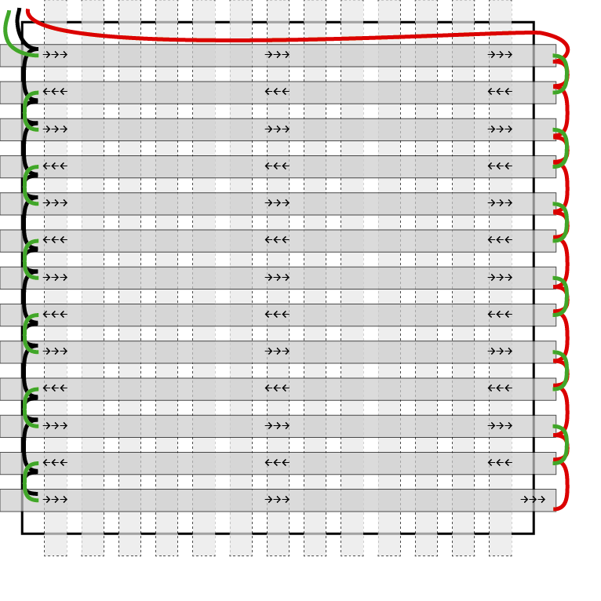
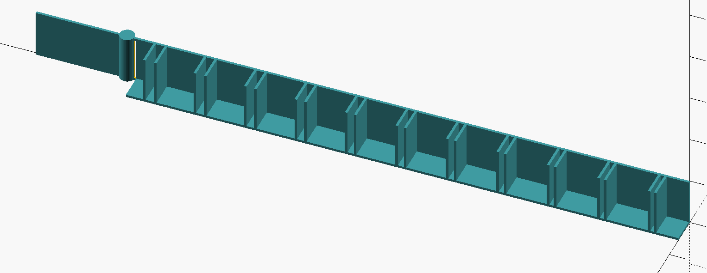

# Kater's Word Clock

Hier kommt meine persönliche Implementierung einer Word Clock. Ziel war es, möglichst wenig baulichen Aufwand zu haben und die Einzelteile aus dem Bastelfundus zu nehmen oder selbst zu erstellen.

So verwende ich für die Elektronik einen WS2812-Strip und ein NodeMCU-Modul (mit einem ESP8266), dazu kommt dann noch ein wenig Kabelmaterial sowie der obligatorische Angstkondensator und -widerstand, außerdem ein USB-Netzteil mit USB-Kabel. Die „Mechanik“ besteht aus einem RIBBA-Rahmen von IKEA, einem 3D-gedruckten Gitter sowie einer mittels Schneidplotter angefertigten Buchstabenmaske, dazu dann noch ein Transparentpapier als Diffusor und ein paar Klebestreifen. Es gibt kein RTC-Modul und keine Bedienelemente, da die Uhr sich die Zeit automatisch per NTP aus dem Netz holt und ansonsten keine steuerbaren Funktionen hat. Wenn es mal eine Konfigurationsmöglichkeit geben soll, würde ich das als Webserver implementieren (s.u.). Die Hardware selbst hat aber noch reichlich Reserven, so dass man da auch noch eine Menge an Erweiterungen anbauen könnte.

## Stückliste
1. IKEA RIBBA Rahmen (23 cm)
1. NodeMCU-Modul ESP8266 (o.ä.; siehe Text)
1. optional: Breadboard(s) für die Schaltung
1. WS2812-LED-Strip mit 60 LEDs/m; selbstklebend, weißes Trägermaterial ohne Beschichtung oder Silikonschlauch; 169 LEDs werden gebraucht
1. Widerstand 470 Ω
1. Elko mind. 1000 µF / 16 V
1. USB-Netzteil (2 A) und Micro-USB-Kabel
1. geplottete Maske auf Folie/Glas/Plexiglas
1. ggf. Transparentpapier (23 cm x 23 cm)
1. gedrucktes Gitter
1. Kabel, Montagematerial (Klebestreifen u.ä.)

## Firmware
Ich habe mal sämtliche Zwischenstufen der Firmware ins Repository gepackt (unter `ESP8266`), damit man die Entwicklungsschritte nachvollziehen kann, wenn man denn möchte. Ansonsten einfach die höchste Version verwenden, das ist derzeit `WordClock_V1.3_Nightmode`.
Die Software ist einigermaßen ausführlich kommentiert und auch nicht allzu kompliziert. Nach dem Booten wird (in `startup()`) als erstes eine Art Hintergrund-Farbverlauf auf die Matrix gelegt (`set_matrix()`). Danach wird versucht, sich ins WLAN einzubuchen, die Zeit per NTP zu holen und schließlich die Zonendefinition für Deutschland zu holen. Damit wird auch die geplante Abschaffung der Sommerzeitumstellung automatisch berücksichtigt. In dieser Phase wird zunächst "`WAN`" angezeigt, dann "`ZEIT`" und schließlich "`DE`" (bzw. "`WZ`", wenn nur die Weltzeit (UTC) angezeigt werden kann). Außerdem zeigt die Uhr zu Beginn eine Art Signatur an.

Sobald das Setup beendet ist, wird die Matrix schwarz geschaltet und einmal pro Sekunde die aktuelle Zeit angezeigt (`show_time()`). Der Text zur jeweiligen Uhrzeit wird nach einem relativ einfachen Schema bestimmt (`encode_time()`). Für regionale Abweichungen („_Dreiviertel Zwölf_“ statt „_Viertel vor Zwölf_“ etc.) muss hier angepasst werden; die Matrix braucht dann ggf. auch weitere Änderungen für die benutzten Wörter. Der generierte Text wird anschließend auf die Matrix gelegt (`show_text()`). Dabei wird bei den erleuchteten Pixeln (`set_led()`) wieder der Farbverlauf (`xy2col()`) unterlegt, der zusätzlich jede Sekunde (`action()`) um ein Feld weiterwandert (`change_colorscheme()`). Jede volle Minute wird der Farbverlauf komplett neu zufällig bestimmt (`change_colorscheme(1)`). Außerdem wird dann jeweils festgestellt, ob die Helligkeit für den Nachtmodus heruntergesetzt werden soll (`is_day()`).

Die Codierung der Wörter in der Matrix ist durch die Konstantendefinitionen `C_`... gegeben. Das sind 4-Byte-Werte, deren unterste drei Bytes der Reihe nach x-Koordinate, y-Koordinate und Länge des Worts angeben. Das oberste Byte ist ungenutzt. Wenn die Belegung der Matrix geändert wird, muss hier angepasst werden.

## Elektronik
Einfacher geht es nicht: Ein ESP8266-Modul, das mit Port D2 (das ist konfigurierbar) an den WS2812-Strip angeschlossen wird, ist eigentlich schon alles. In die Datenleitung sollte in Serie ein 470Ω-Widerstand eingefügt werden, zwischen 5V und Masse sollte ein hinreichend großer Elko gesetzt werden. **Wichtig:** Wenn der Strip über den USB-Anschluss des ESP-Moduls versorgt wird (beim NodeMCU wäre das der Anschluss Vin), fließt die Stromversorgung des Strips über das µController-Modul. Ich habe die Erfahrung gemacht, dass das bei einem NodeMCU kein Problem darstellt, ein Wemos D1 mini dann aber schon strengt riecht und heiß wird – keine gute Lösung. Alternativ kann man sich also eine anderweitige 5V-Versorgung verschaffen, von der das ESP-Modul und der LED-Strip nebeneinander versorgt werden. YMMV.

Das Controllermodul kann optional auf ein Breadboard (oder zwei, je nach Format) aufgesteckt werden, um die Anschlüsse zu realisieren, ansonsten wird alles direkt angesteckt oder angelötet. Die Breadboards haben normalerweise eine Klebefläche auf der Unterseite, mit der das Modul dann bequem an der Rückwand befestigt werden kann.

Die LED-Streifen werden waagerecht auf die Rückwand des Rahmens geklebt, als Hilfe gibt es bei den Plotter-Dateien ein PDF mit dem Layout. Das kann man ausdrucken und zum Anzeichnen auf der RIBBA-Rückwand nehmen, um die Streifen exakt aufkleben zu können. Manchmal sind die LED-Stips nicht ganz exakt gefertigt – am besten genau aufpassen, dass die LEDs möglichst mittig in den Zellen zu liegen kommen. Zur Sicherheit können die Streifen auch zusätzlich mit etwas Heißkleber fixiert werden.

Die Streifen werden im Zickzack verlegt, d.h. der oberste Streifen läuft von links nach rechts (Din → Dout ist auf dem Strip aufgedruckt), der nächste dann von rechts nach links und so weiter. Der Din-Anschluss oben links ist mit dem µController verbunden, der Dout-Anschluss oben rechts wird in den Din der zweiten Reihe (ebenfalls rechts) geführt. Deren Dout links geht dann in den Din der dritten Reihe usw., der letzte Dout bleibt dann offen. Das zweite PDF zeigt auch die Verkabelung: Grün für die Datenleitung, Rot für 5 Volt, Schwarz für Masse.

Die Stromversorgung wird am besten folgendermaßen durchgeführt: Auf der rechten Seite werden alle Vcc-Anschlüsse miteinander verbunden und mit +5V (Vin am µController) verbunden, auf der linken Seite entsprechend alle Gnd-Anschlüsse, die wiederum mit der Masse (G oder Gnd) verbunden werden.

Als Problem beim Löten könnte sich herausstellen, die jeweils 13 Lötstellen für Plus und Masse der Reihe nach zu verbinden. Da gibt es verschiedene Optionen, von denen man sich die aussuchen sollte, die einem am besten passt:

### A: Girlande
Ich hatte das so gemacht, dass ich im Kabel alle ca. 2,5 cm ein paar Millimeter abisoliert habe, die freie Stelle geknickt, verzinnt und dann auf den Streifen gelötet habe. Das ist etwas fummelig, funktioniert grundsätzlich aber gut.

### B: Stern
Eine (noch nicht getestete) Alternatividee wäre es, für jeden Streifen den Plus-Anschluss auf der einen und den für Masse auf der anderen Seite per Litze nach hinten zu führen und diese je 13 Kabel in je einer Lüsterklemme zusammenzufassen und mit der restlichen Schaltung zu verbinden.

### C: Baum
Ein weiterer Vorschlag wäre, die Anschlüsse von jeweils zwei Streifen zusammenzuführen und als ein Kabel weiterzuführen. Das Ganze dann kaskadiert, bis nur noch ein einziges Kabel mit dem Rest der Schaltung zu verbinden ist.

### D: Schiene
Oder man führt je ein blankes Kabel (links für Masse, rechts für +5V) im Abstand an den Streifen vorbei und zieht dann kurze Querverbindungen. Die gemeinsame Schiene wird dann auf der anderen Seite mit der Schaltung verbunden.

Nicht so optimal wäre es übrigens, die Masse- und Plus-Leitungen analog zu den Datenleitungen im Zickzack durch alle Streifen zu führen. Das kann zur Folge haben, dass am Ende dann nicht mehr die volle Spannung ankommt – zu sehen daran, dass die blauen LEDs nicht mehr voll aufleuchten können und die Farben zum Ende hin „vergilben“.

Zur Kabelführung auf die Rückseite mit der Elektronik kann man an Ecken oder Rändern mit einem Seitenschneider kleine Aussparungen „herausknipsen“. Die Kabel sollten dann auf der Rückseite mit Klebestreifen fixiert werden.

## Schneidplotter
Unter `Plotter` finden sich die Masken (für Silhouette Cameo), außerdem die erwähnten PDFs zum Anzeichnen und Verdrahten. Wenn man die Schriftart in der Maske ändern möchte, kann man einfach alles selektieren und dann eine andere Schriftart wählen. Man sollte dann aber spaltenweise die Textobjekte (also die Buchstaben) selektieren und gemeinsam neu zentrieren, sonst wirkt das Ergebnis unregelmäßig. Die Datei wird dann auf dem Plotter in eine Klebefolie geschnitten, die Buchstaben werden entfernt (Achtung, die „Öffnungen“ in den Buchstaben stehen lassen) und dann mittels Transferfolie auf einen Träger aufgebracht. Das kann entweder eine (Plexi-)Glasplatte im selben Format wie die RIBBA-Glasplatte sein oder einfach eine Kunststofffolie, die nur nicht zu weich sein sollte, weil sonst die Maske nicht ordentlich plan liegt. Wenn eine milchige Plexiglasplatte verwendet wird, entfällt die Transparentpapierlage. Oder man klebt die Folie auf das Transparentpapier und legt das dann zwischen zwei Glasplatten – so wäre ein Austausch der Matrix relativ einfach machbar und die Maske würde einigermaßen plan liegen.

Wer will, kann die Klebefolie auch außen auf die RIBBA-Glasplatte aufbringen, aber ich denke, dass es dann ein Problem mit Staub geben wird.

Alternative Lösung: Die Maske direkt auf das Transparentpapier drucken, mit Laser oder Tinte. Da wäre zu testen, ob der Kontrast dann ausreicht oder ob zuviel Störlicht durch die schwarzen Bereich dringt. Außerdem ist zu berücksichtigen, dass 23 Zentimeter die Druckbreite eines A4-Druckers übersteigen.

## 3D-Druck
Im Verzeichnis `3D_Printer` schließlich liegt eine OpenSCAD-Quelldatei für das Gitter. Da mein Drucker Objekte mit maximal 20 cm Kantenlänge drucken kann, habe ich das Gitter in vier Viertel aufgeteilt, die ineinandergesteckt werden können. Wer nichts weiter verändern möchte, kann direkt die STL-Datei `WordClockMatrix13x13_quarter.stl` in den Slicer laden. Um die genauen Maße auszutesten, hatte ich eine kleine Version mit insgesamt 5x5 Zellen gedruckt (`WordClockMatrix13x13_TEST5x5.stl`). Das Werkstück enthält selbst schon eine minimale Stützstruktur, im Slicer braucht es also keine weitere. Die vier dünnen Stäbe an jedem Viertelteil können dann nach dem Druck leicht entfernt werden. Das zusammengesetzte Gitter passt genau in den 23 mal 23 Zentimeter großen Rahmen, dabei ergibt sich rund um die LEDs ein Rand von 0,67 cm, der gut zur Überlappung von Rahmen und Glasscheibe passt, sodass keine LED-Zelle verdeckt wird.

Alternativ kann unten am Ende der Quelldatei anstelle des Viertelteils auch ein einzelnes Gitter erzeugt werden, wenn der Drucker die Abmessungen drucken kann. Hierzu anstelle von `MatrixQuarter()` einfach `SingleMatrix()` aufrufen. Zum Testen gibt es noch `CompoundMatrix()`, um vier Viertelteile zu erzeugen; der Parameter `dist` gibt den Abstand der Teile untereinander an. Mit `CompoundMatrix(dist=0)` werden sie direkt ineinandergefügt – nicht zum drucken, sondern nur zur direkten Kontrolle in OpenSCAD. 

Außerdem kann mit `FitTest()` ein Testobjekt gedruckt werden, das bei der Anpassung der Maße für die Wandaufnahmen (trichterförmige Strukturen) helfen kann. Nach dem Druck wird das Teil mit dem Zylinder am rechten Ende an der Sollbruchstelle abgetrennt. Die Wand hat die parametrierte Stärke und kann nun testweise in die verschieden breiten Aufnahmetrichter gedrückt werden, um den passendsten zu finden. Von schmal bis weit entsprechen die Trichter dem Faktor 1,2, dann 1,3, dann 1,4 usw. in Zehntelschritten bis 2,2. Den gefundenen Faktor trägt man oben in der Parameterliste ein, um schließlich die Gitterobjekte zu erzeugen. Dabei sollten die Slicing- und Druck-Parameter nicht geändert werden.

In der Datei werden oben die Parameter für die Matrix gesetzt, also die Außenmaße, Anzahl der LED-Zellen, Zellengröße, Wandstörke, Höhe des Gitters sowie Größe der kleinen rautenförmigen Stabilisierungsstrukturen an den Gitterkreuzungspunkten, außerdem der Faktor für die Wandaufnahmen, der mit dem FitTest-Teil ermittelt wurde. Die Werte für den kleinen RIBBA-Rahmen (23 cm) sind erprobt, die für den großen noch nicht – mit meinem Drucker werde ich da ohnehin noch weiter aufteilen müssen; das wird in einer zukünftigen Version geschehen.

Als Druckmaterial hat sich schwarzes PLA bewährt. Die Lichtverluste gegenüber dem weißen Material machen sich nicht wesentlich bemerkbar, dafür gelangt aber kein Störlicht in benachbarte Zellen, auch bei den vergleichsweise dünnen Wänden.

Hinweis: Je nach Slicerprogramm und Druckparametern darin kann es vorkommen, dass die Wände nicht gerendert werden. In diesem Fall muss die Wandstärke höher gesetzt werden. Die voreingestellten 0,4 mm reichen aber für die Stabilität und auch Licht-Dichtigkeit aus.

## Aufbau
Der Innenrahmen des RIBBA-Rahmens wird nicht benötigt, ebensowenig das Passepartout. In den Rahmen kommen jetzt der Reihe nach:
1. Die vordere, originale Glasplatte
1. Die Maske, auf Folie/Glas/Plexiglas geklebt
1. Ein zugeschnittenes Transparentpapier
1. Das Gitter (die rautenförmigen Stabilisatoren an den Kreuzungspunkten liegen auf der Seite mit den LED-Streifen)
1. Die Rückwand mit den aufgeklebten LED-Streifen vorne und der Elektronik auf der Rückseite

Die Rückwand wird dann schließlich im Rahmen befestigt, etwa mit Klebestreifen oder Heißkleber oder den vorhandenen Blechstreifen, die nach innen versetzt werden müssten.

## Erweiterungen
Wie schon erwähnt, für Hardwareerweiterungen sind noch jede Menge Ressourcen frei, softwareseitig sowieso. Ein paar Ideen:
- Hardware
    - Lichtsensor, um die Helligkeit automatisch an die Umgebung anzupassen
    - größere Matrix (s.u.)
    - Bedienelemente (Taster oder auch Lichtsensoren, die auf kurzes Abdecken mit dem Finger reagieren)
    - Sound
    - Bewegungssensor (PIR-Modul)
- Software
    - Konfigurationsseite per Web
    - besondere Animation zur vollen Stunde
    - Ansteuerung per MQTT
    - Ansteuerung per TPM2 oder Artnet
    - weitere Informationsanzeigen (Mondphase, Wetter, …)

## Große Uhr
Im Prinzip kann man das Ganze auch in größer anfertigen; ich habe es noch nicht versucht, werde das aber möglicherweise als nächstes Projekt angehen. Notwendige Änderungen:

### Rahmen: 
Es gibt beispielsweise einen weiteren „tiefen“ RIBBA-Rahmen mit 50 cm (statt 23 cm) Kantenlänge, der sich anbietet. Das Passepartout darin hätte 30 x 30 cm.

### Hardware: 
Man kann entweder den gleichen WS2812-Strip mit 60 LEDs pro Meter nehmen und erhält dann z.B. 25 x 25 (also 625) LEDs — das ist vielleicht etwas viel. Da könnte die Matrix auch etwas kleiner gemacht werden: Ins mitgelieferte Passepartout passen 18 x 18, also immerhin noch 324 LEDs. Oder man greift zu einem Strip mit 30 LEDs pro Meter, von denen dann also maximal 15 x 15 (also 225) untergebracht werden können (im Passepartout nur 9 x 9, das wird schon knapp). Dann ist dementsprechend das Gitter anzupassen, und wir brauchen bei über 35 cm Kantenlänge auch mehr als nur vier Teilstücke (oder einen größeren Drucker). Auch mag es nötig sein, die Höhe des Gitters auf mehr als 10 mm zu erhöhen, damit die größeren Zellen gleichmäßig ausgeleuchtet werden.

Wichtig bei sehr vielen LEDs: Auf den Stromverbrauch achten, sonst qualmt es irgendwo. Oder in der Software dafür sorgen, dass niemals zu viele LEDs gleichzeitig leuchten.

### Software: 
Dort ist im Prinzip alles vorbereitet, es müssen nur die diversen Konstanten angepasst werden.